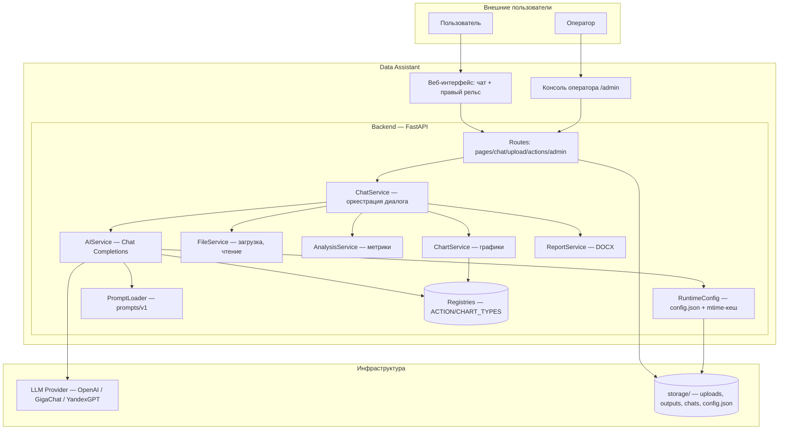

# 💬 Data Assistant

⚡ **Загрузите файл — получите анализ, графики и DOCX-отчёт в чате с AI. Любой OpenAI-совместимый провайдер, смена без рестарта.**

Data Assistant — веб-приложение для анализа данных в формате чата. Пользователь загружает CSV/Excel/JSON или изображение и общается с AI-ассистентом на естественном языке; модель планирует действия, приложение исполняет их локально — строит графики, считает метрики, собирает DOCX-отчёты и хранит артефакты. Работает с любым OpenAI-совместимым провайдером (OpenAI, GigaChat, YandexGPT, «Свой»).

- Аналитик загружает `sample_sales.csv` и пишет «построй круговую выручки по категориям» — получает график в чате и скачивает PNG.
- Оператор меняет провайдера (OpenAI → GigaChat) и системный промпт в `/admin` — следующий запрос идёт в новый провайдер, без пересборки и рестарта контейнера.
- Заказчик нажимает «Создать DOCX» — получает отчёт с метриками и графиками, готовый документ, который можно сразу отдать клиенту.

Data Assistant не строит дашборды 24/7, не хранит ваши данные в облаке и не привязывает к одному LLM-провайдеру. Артефактный конвейер (upload → анализ → 4 типа графиков → DOCX → скачивание) исполняется локально; модель только планирует.

[▶️ Попробовать live demo](https://data-assistant.alex-n8n.site) · [💼 Бизнес-ценность](docs/BUSINESS_VALUE.md) · [🎬 Как это работает](docs/E2E_SCENARIOS.md)

> 📌 **Атрибуция:** идея и первоначальная структура проекта взяты из репозитория [`MrGAN12009/data_assistant`](https://github.com/MrGAN12009/data_assistant). Текущая версия переработана в мультипровайдерный data-ассистент с runtime-конфигом оператора (пресеты OpenAI/GigaChat/YandexGPT, редактор промпта, статистика использования), добавлены pie-графики и DOCX-отчёты, structured output + fallback, подготовлена публичная документация.

---

## ▶️ Live Demo

🌐 **Пользователю:** [▶️ Открыть веб-интерфейс](https://data-assistant.alex-n8n.site)

Загрузите CSV или изображение и напишите запрос в чат — например «проанализируй файл» или «построй круговую диаграмму выручки по категориям». Ассистент сам выберет действие и вернёт результат в чат. Никакой регистрации и установки — нулевой порог входа.


Скриншоты, live demo и сквозные сценарии — в [`docs/SCREENSHOTS.md`](docs/SCREENSHOTS.md) и [`docs/E2E_SCENARIOS.md`](docs/E2E_SCENARIOS.md).

---

## ❓ Зачем нужен Data Assistant

Команды, которым нужен быстрый взгляд на данные, сталкиваются с тремя типичными крайностями:

| Подход | Ограничение |
|--------|-------------|
| **Ручной анализ в Excel/BI** | требует навыков и времени; каждый новый вопрос — заново строить график или сводную |
| **Универсальный LLM-чат (ChatGPT и пр.)** | данные никуда не загружаются; модель «на глаз» выбирает колонки и не гарантирует воспроизводимый артефакт |
| **Тяжёлая BI-платформа** | длинный setup, дашборды 24/7, привязка к вендору — избыточно для разового вопроса по файлу |

**Data Assistant решает эту проблему**, разделяя ответственность:

- **Модель планирует** — читает контекст файла и решает, какое действие выполнить (анализ, график, отчёт, сводка).
- **Приложение исполняет локально** — метрики, графики и DOCX строятся детерминированно по реестру `ACTION_TYPES`/`CHART_TYPES`; модель не может вернуть действие, которого нет в системе.
- **Артефакты скачиваются** — PNG-графики и DOCX-отчёты сохраняются в чате и доступны для скачивания.
- **Провайдер портабелен** — пресеты OpenAI / GigaChat / YandexGPT / «Свой» в `/admin`; смена провайдера и промпта применяется на следующем запросе без рестарта.

Больше о бизнес-ценности — в [`docs/BUSINESS_VALUE.md`](docs/BUSINESS_VALUE.md).

---

## 🎯 Для кого

- Аналитики и продакт-менеджеры, которым нужен быстрый взгляд на CSV без разворачивания BI.
- Операционные команды, делающие регулярные выгрузки и отчёты по файлам.
- Консультанты и сейлз-команды, показывающие данные заказчику на живом демо.
- Интеграторы, которым нужен портабельный AI-data-chat с любым OpenAI-совместимым провайдером.

---

## ✨ Ключевые возможности

- **Чат с моделью** — ассистент читает контекст файла и сам решает, какое действие выполнить (анализ, график, отчёт, сводка).
- **Файлы** — CSV, Excel (`.xlsx`/`.xls`), JSON, изображения (PNG/JPG/JPEG/BMP/GIF/WEBP).
- **Графики** — `histogram`, `bar`, `line`, `pie` в PNG; тип и колонки подбирает модель либо оператор чипом.
- **DOCX-отчёты** — отчёт по файлу с метриками и графиками, скачивается из чата.
- **Markdown-сводки** — выводы сохраняются в `.md` для дальнейшей автоматизации.
- **Мультипровайдерность** — пресеты OpenAI / GigaChat (Сбер, OAuth-адаптер) / YandexGPT (`folder_id` + `x-folder-id`) / «Свой» в `/admin`; одним кликом заполняются endpoint, модель, имя и `structured_output`. Смена без рестарта.
- **Runtime-конфиг оператора** — специализацию, модель, провайдер, температуру, seed, специализацию и промпт меняют через веб-админку `/admin` без пересборки и рестарта контейнера.
- **Structured output + fallback** — строгий контракт ответа через `json_schema`; для провайдеров без поддержки — устойчивый парсер free-text (GigaChat, YandexGPT).
- **Статистика использования** — дашборд запросов, ошибок и токенов в `/admin` для контроля стоимости LLM.
- **Честные границы** — `/admin` за HTTP Basic; публичный Web UI без аутентификации; секреты только в `.env`.

---

## 🏗️ Краткий обзор архитектуры



- **Registries** — единый источник истины действий и графиков; модель не может вернуть то, чего нет в реестре.
- **RuntimeConfig** — операторские параметры в `storage/config.json` (mtime-кеш + write-lock); правки через `/admin` применяются на следующем запросе без рестарта.
- **AIService** — мультипровайдерный; маршрутизация по `auth_mode` пресета (OpenAI SDK путь / GigaChat-адаптер).

Подробнее — в [`docs/ARCHITECTURE.md`](docs/ARCHITECTURE.md).

---

## 🌐 Публичные точки входа

| Роль | Сервис | Адрес | Назначение |
|------|--------|-------|------------|
| Пользователь | Веб-интерфейс | [data-assistant.alex-n8n.site](https://data-assistant.alex-n8n.site) | Чат с ассистентом, загрузка файлов, графики, отчёты |
| Оператор | Консоль `/admin` | [data-assistant.alex-n8n.site/admin](https://data-assistant.alex-n8n.site/admin) | Runtime-параметры, промпт, провайдер, статистика |

> 🔓 **Вход оператора:** HTTP Basic (`admin` / `ADMIN_TOKEN` из `.env`). Публичный чат — без аутентификации.

---

## 📚 Документация

### Для заказчиков и менеджеров

| Документ | Описание |
|----------|----------|
| [💼 `docs/BUSINESS_VALUE.md`](docs/BUSINESS_VALUE.md) | Бизнес-проблема, решение, эффект, выгода |
| [🎬 `docs/E2E_SCENARIOS.md`](docs/E2E_SCENARIOS.md) | Сквозные бизнес-сценарии (чат + админка) |
| [🖼️ `docs/SCREENSHOTS.md`](docs/SCREENSHOTS.md) | Галерея экранов с подписями |

### Для пользователей и операторов

| Документ | Описание |
|----------|----------|
| [📖 `docs/USER_GUIDE.md`](docs/USER_GUIDE.md) | Как пользоваться чатом — файлы, графики, отчёты |
| [🎛️ `docs/OPERATOR_GUIDE.md`](docs/OPERATOR_GUIDE.md) | Управление параметрами через `/admin` |
| [🔐 `docs/SECURITY_NOTES.md`](docs/SECURITY_NOTES.md) | Секреты, границы, безопасность |

### Для инженеров и интеграторов

| Документ | Описание |
|----------|----------|
| [🏗️ `docs/ARCHITECTURE.md`](docs/ARCHITECTURE.md) | Архитектура, слои, реестры, runtime-конфиг, mermaid |
| [📝 `docs/PROMPT_ARCHITECTURE.md`](docs/PROMPT_ARCHITECTURE.md) | Структура промпта, плейсхолдеры, валидация ответа |
| [🔌 `docs/API_CONTRACT.md`](docs/API_CONTRACT.md) | Контракт HTTP-эндпоинтов (Web UI as-is) |
| [🤖 `docs/EXTERNAL_PROVIDERS.md`](docs/EXTERNAL_PROVIDERS.md) | Параметры OpenAI-совместимых провайдеров |
| [🧪 `docs/TESTING.md`](docs/TESTING.md) | Стратегия тестирования |
| [📋 `docs/IMPLEMENTATION_PLAN.md`](docs/IMPLEMENTATION_PLAN.md) | План реализации |
| [📊 `docs/PROJECT_STATE.md`](docs/PROJECT_STATE.md) | Текущее состояние и roadmap |
| [🚀 `docs/DEPLOYMENT_GUIDE.md`](docs/DEPLOYMENT_GUIDE.md) | Воспроизводимое развёртывание (Source of Truth) |
| [✅ `docs/DEPLOYMENT_VALIDATION_REPORT.md`](docs/DEPLOYMENT_VALIDATION_REPORT.md) | Отчёт валидации в чистом окружении |

---

## ✅ Статус проекта

Реализованы все ключевые компоненты: чат с моделью, загрузка файлов (CSV/Excel/JSON/изображения), 4 типа графиков, DOCX-отчёты, markdown-сводки, мультипровайдерность (OpenAI / GigaChat / YandexGPT / «Свой»), runtime-конфиг оператора без рестарта, structured output + fallback-парсер, статистика использования, публичный HTTPS-эндпоинт.

**Deployment Validation:** пройдена — воспроизведение с нуля по `DEPLOYMENT_GUIDE` в чистом окружении, отчёт в [`docs/DEPLOYMENT_VALIDATION_REPORT.md`](docs/DEPLOYMENT_VALIDATION_REPORT.md).

Текущее состояние и следующий шаг — в [📊 `docs/PROJECT_STATE.md`](docs/PROJECT_STATE.md).

---

## 🛠️ Технологии

- **Backend** — FastAPI, Python 3.12.
- **Frontend** — Jinja2 + HTMX (без SPA-сборки).
- **Графики** — matplotlib.
- **Отчёты** — python-docx.
- **AI** — OpenAI SDK + GigaChat-адаптер (OAuth, прямой HTTP).
- **Deploy** — Docker Compose, Traefik (обратный прокси, HTTPS).

---

## 🚀 Быстрый запуск

```bash
# 1. Подготовьте .env (секреты и bootstrap)
cp .env.example .env
#    заполните OPENAI_API_KEY и ADMIN_TOKEN
#    (GIGACHAT_AUTH_KEY — только для пресета GigaChat)

# 2. Запустите локально (dev-режим — публикует порт, live reload)
docker compose up -d --build

# 3. Откройте http://localhost:8000
```

| Сервис | URL |
|--------|-----|
| Веб-интерфейс | http://localhost:8000 |
| Консоль оператора | http://localhost:8000/admin |
| Health | http://localhost:8000/health |

> Production (без публикации порта, за обратным прокси) и полный процесс развёртывания — в [`docs/DEPLOYMENT_GUIDE.md`](docs/DEPLOYMENT_GUIDE.md).

---

## ⚠️ Ограничения демо

- **Демонстрационный MVP**: упрощённые сценарии; локальный артефактный конвейер (upload → анализ → графики → DOCX → скачивание) исполняется детерминированно, LLM-контур требует реальных токенов провайдера.
- Реестры действий и графиков — кодовые (`app/services/registries.py`); вынос в редактируемые параметры — в roadmap.
- YandexGPT: код-путь верифицирован (routing + заголовки), end-to-end требует API-ключа Yandex и `folder_id`.
- Перед production рекомендуется добавить корпоративную аутентификацию `/admin`, бэкапы `storage/`, мониторинг и CI/CD.

---

## 🔑 Ключевые принципы

1. **Модель планирует, приложение исполняет** — метрики, графики и DOCX строятся локально по реестру; модель не может вернуть действие, которого нет в системе.
2. **Registries — Source of Truth** — `ACTION_TYPES`/`CHART_TYPES` едины для валидации, JSON-схемы и UI.
3. **Три источника истины, без дублирования** — секреты в `.env`, операторские параметры в `storage/config.json`, промпт в `prompts/v1/system.md`.
4. **Runtime-конфиг без рестарта** — правки через `/admin` применяются на следующем запросе (mtime-кеш + write-lock).

---

## 📁 Структура проекта

```
ai-data-assistant/
├── README.md                      # Точка входа в проект
├── docs/                          # Документация кейса
│   ├── BUSINESS_VALUE.md          # Бизнес-ценность
│   ├── E2E_SCENARIOS.md           # Сквозные бизнес-сценарии
│   ├── SCREENSHOTS.md             # Галерея экранов
│   ├── USER_GUIDE.md              # Руководство пользователя
│   ├── OPERATOR_GUIDE.md          # Руководство оператора
│   ├── ARCHITECTURE.md            # Архитектурные решения
│   ├── PROMPT_ARCHITECTURE.md     # Структура промпта
│   ├── API_CONTRACT.md            # Контракт HTTP-эндпоинтов
│   ├── EXTERNAL_PROVIDERS.md      # Параметры провайдеров LLM
│   ├── TESTING.md                 # Стратегия тестирования
│   ├── IMPLEMENTATION_PLAN.md     # План реализации
│   ├── DEPLOYMENT_GUIDE.md        # Развёртывание с нуля
│   ├── DEPLOYMENT_VALIDATION_REPORT.md  # Отчёт валидации
│   ├── PROJECT_STATE.md           # Текущее состояние и roadmap
│   ├── SECURITY_NOTES.md          # Безопасность
│   └── screenshots/               # Скриншоты интерфейса
├── app/                           # Backend (FastAPI)
│   ├── core/config.py             # Pydantic Settings, bootstrap
│   ├── routes/                    # pages, chat, upload, actions, admin
│   ├── services/                  # ai, chat, chart, report, file, analysis, …
│   └── main.py
├── prompts/v1/system.md           # Системный промпт (плейсхолдеры)
├── templates/                     # Jinja2: страницы + HTMX-паршлы + admin
├── static/                        # CSS/JS
├── examples/                      # sample_sales.csv, sample_chart_data.csv
├── Dockerfile
├── docker-compose.yml             # production (сборка, без порта)
├── docker-compose.override.yml    # dev/operator (порт + --reload)
├── requirements.txt
└── .env.example
```

> **Примечание:** внутренние материалы инженерной среды (история задач, черновики, вложения) хранятся вне публичного репозитория и не включены в структуру выше.

---

## 📄 Лицензия

Учебный проект. Используйте и адаптируйте свободно.

Проект разработан в инженерной среде AI Automation Portfolio Lab.