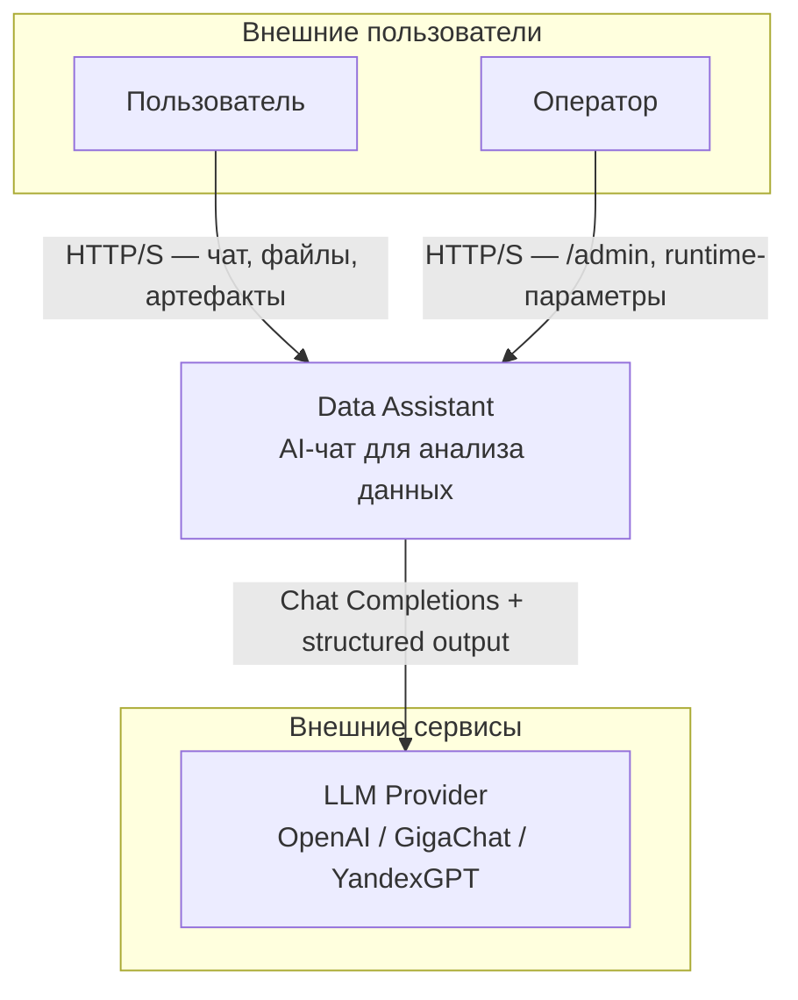
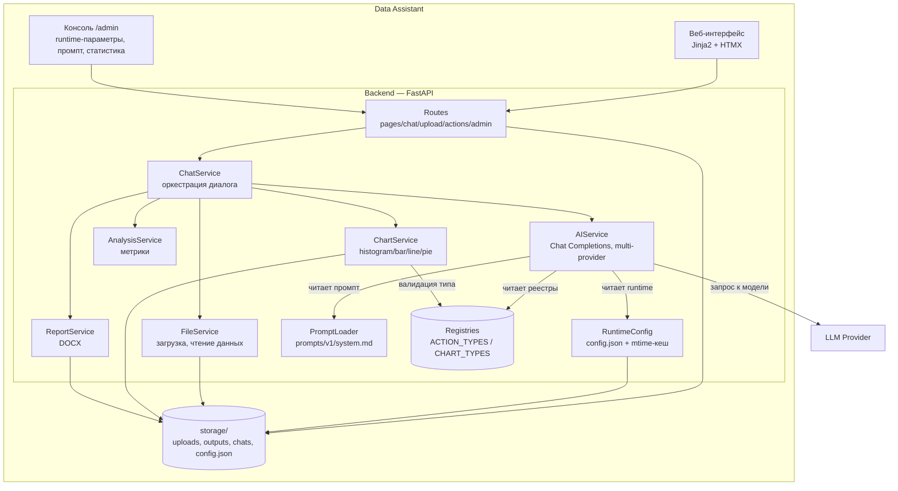
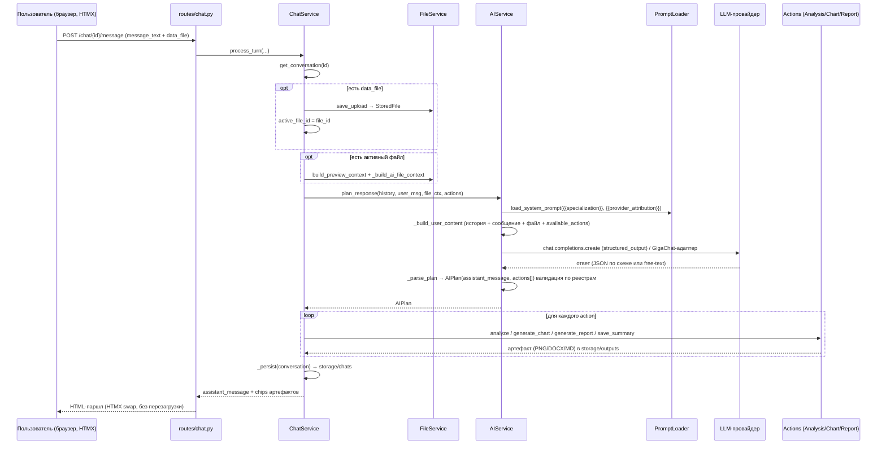

# 🏗️ ARCHITECTURE.md — Data Assistant

**Проект:** ai-data-assistant
**Дата:** 2026-08-13
**Статус:** as-built

---

## 🎯 1. Обзор

Data Assistant — веб-приложение для анализа данных в чате. Пользователь
загружает файл и общается с AI-ассистентом; модель планирует действия,
приложение исполняет их локально (графики, отчёты, метрики).

Ключевая архитектурная идея: **разделение bootstrap-параметров (стартовых,
требуют рестарта) и операторских параметров (runtime, меняются без рестарта)**
— вариант 3.

### 🌐 Context Diagram (C4 Level 1)



### 📦 Container Diagram



- **Registries** — единый источник истины действий и графиков; модель не
  может вернуть действие или график, отсутствующий в реестре.
- **RuntimeConfig** — операторские параметры в `storage/config.json`
  (mtime-кеш + write-lock); правки через `/admin` применяются на следующем
  запросе без рестарта.
- **AIService** — мультипровайдерный; маршрутизация по `auth_mode` пресета
  (OpenAI SDK путь / GigaChat-адаптер).

---

## 🧩 2. Слои

| Слой | Назначение | Ключевые файлы |
|------|------------|----------------|
| **Routes** | HTTP-эндпоинты, HTMX-рендер | `app/routes/{pages,chat,upload,actions,admin}.py` |
| **Services** | Бизнес-логика | `app/services/*.py` |
| **Config** | Настройки (bootstrap + runtime) | `app/core/config.py`, `app/services/runtime_config.py` |
| **Prompts** | Версионированные промпты | `prompts/v1/system.md`, `app/services/prompt_loader.py` |
| **Registries** | Единый источник истины действий/графиков | `app/services/registries.py` |
| **Templates** | Jinja2 + HTMX | `templates/` |
| **Storage** | Загрузки, артефакты, runtime-конфиг | `storage/` (volume) |

---

## 🔧 3. Конфигурация: три источника истины, без дублирования

Приложение строго разделяет три класса параметров, у каждого — единственный
источник истины (SSOT). Перекрытия и дублирование умолчаний между слоями
отсутствуют намеренно.

### 🔐 3.1. Секреты и bootstrap — `.env` (`Settings`, рестарт)

`app/core/config.py` — Pydantic `BaseSettings`. Здесь живут **только** параметры,
которыми реально управляет окружение процесса:

- **Секреты:** `OPENAI_API_KEY` (Bearer для OpenAI/YandexGPT/«Свой»; для Yandex это
  API-ключ Yandex), `GIGACHAT_AUTH_KEY` (authorization key Сбер — только для
  пресета GigaChat), `GIGACHAT_CA_BUNDLE` (опц. CA-bundle для TLS GigaChat),
  `ADMIN_TOKEN` — только в `.env`, никогда в config.json.
- **Bootstrap:** `APP_HOST`, `APP_PORT`, `LOG_LEVEL`, пути к каталогам
  (`UPLOAD_DIR`, `OUTPUT_DIR`, `STORAGE_DIR`, `TEMPLATES_DIR`, `STATIC_DIR`,
  `PROMPTS_DIR`), `RUNTIME_CONFIG_PATH`.

Все они требуют рестарта процесса. Операторских параметров в `.env` НЕТ.

### 🗂️ 3.2. Операторские параметры — `storage/config.json` (`RuntimeConfig`, без рестарта)

`app/services/runtime_config.py` — единый SOT операторских параметров.
JSON-файл + mtime-кеш + `threading.Lock`:

- **Первоначальная инициализация из хардкода:** при первом старте
  `ensure_initialized()` сеет `storage/config.json` значениями из хардкоженного
  словаря `DEFAULTS` (только `SEEDED_KEYS`). Это намеренный хардкод, а не `.env`:
  одна точка правки умолчаний, `.env` не дублирует операторские параметры.
- Чтение `get(key)`: если ключ в файле — берётся оттуда, иначе fallback к `DEFAULTS`.
- `has(key)`: отличает «явно задан в файле» от «fallback» — критично для
  портабельности (см. ниже).
- Запись `set(key, value)` (через `/admin`): атомарная запись, инвалидация кеша.
- `reset(key)`: удаление ключа — возврат к `DEFAULTS` (для opt-in = «не задавать»).
- mtime-кеш: правка файла (через `/admin` **или** файловым менеджером)
  применяется на следующем запросе без рестарта.

`RUNTIME_KEYS` (порядок = порядок в `/admin`):

| Ключ | Тип | Seeded | Назначение |
|------|-----|--------|------------|
| `assistant_specialization` | str | да | Роль в системном промпте |
| `provider` | str | да | Пресет провайдера (`openai`/`gigachat`/`yandex`/`custom`) |
| `openai_model` | str | да | Модель (generic; для Yandex — URI с `<folder_id>`) |
| `openai_base_url` | str | да | Endpoint провайдера (generic) |
| `structured_output` | bool | да | Строгий контракт ответа |
| `openai_max_history_messages` | int | да | Сообщений истории в запросе |
| `max_file_size` | str | да | Лимит файла (напр. `10MB`) |
| `provider_name` | str\|null | **нет** (opt-in) | Имя провайдера в контенте (null = нейтрально) |
| `openai_temperature` | float | **нет** (opt-in) | Температура; отправляется только если задана |
| `openai_seed` | int\|null | **нет** (opt-in) | Seed; отправляется только если задан |
| `yandex_folder_id` | str\|null | **нет** (opt-in) | Folder Yandex Cloud (только для пресета `yandex`) |

> Ключи `openai_base_url`/`openai_model` имеют исторический префикс `openai_`,
> но фактически это **generic** endpoint/model — используются всеми пресетами.
> Выбор пресета в `/admin` (POST `/admin/provider`) заполняет `provider` +
> эти поля из реестра `PROVIDER_PRESETS` (см. §4); поля остаются независимо
> редактируемыми.

> **Почему opt-in ключи не сеются.** `ensure_initialized` сеет только
> `SEEDED_KEYS`; `provider_name`/`openai_temperature`/`openai_seed`/
> `yandex_folder_id` остаются отсутствующими, пока оператор их не задаст.
> Поэтому `has("openai_temperature")` после чистого старта — `False`, и
> температура **не отправляется** в запрос. Это портабельность: модели вроде
> `gpt-5-mini` принимают только умолчательную температуру и отвергают любое
> иное значение. Оператор, явно задавший температуру в `/admin`, получает
> `has()=True` — она отправляется.

### 📝 3.3. Системный промпт — файл `prompts/v1/system.md` (`PromptLoader`, без рестарта)

Единый SOT текста промпта — сам файл (не config.json). Чтение с mtime-кешем;
оператор правит его через `/admin` (POST `/admin/prompt` пишет в файл) или
файловым менеджером — применяется на следующем запросе. В production каталог
`prompts/` монтируется volume (`./prompts:/app/prompts`), чтобы правки переживали
пересборку. Переменные шаблона `{{specialization}}` / `{{provider_attribution}}`
интерполируются значениями из `RuntimeConfig`.

> Секреты (`OPENAI_API_KEY`, `ADMIN_TOKEN`) **никогда** не входят в config.json
> и не пишутся в файл промпта — только в `.env`.

---

## 🗂️ 4. Реестры — единый источник истины

`app/services/registries.py`:

```python
ACTION_TYPES = ("preview", "analyze", "generate_chart", "generate_report", "save_summary")
CHART_TYPES  = ("histogram", "bar", "line", "pie")
```

Из реестров выводятся:

- валидация действий и типов графиков в `ChatService`/`AIService`/`ChartService`;
- enum'ы в JSON-схеме structured output (`_build_response_schema`);
- `available_actions` — подсказка модели (`_build_available_actions`);
- fallback-детекция типа графика в `_detect_chart_type`;
- help-сообщение в чате.

Следствие: модель **не может** вернуть действие или график, который приложение
не умеет исполнять. Добавление нового графика — одна строка в реестре +
реализация в `chart_service`.

### 🔌 4.1. Реестр пресетов провайдеров (`PROVIDER_PRESETS`)

Тот же файл `registries.py` хранит пресеты провайдеров для `/admin`. Каждый
пресет: `label`, `provider_name`, `base_url`, `default_model`,
`structured_output`, `auth_mode` (`openai_key` | `gigachat_oauth` |
`yandex_folder`), опц. `token_url`/`scope` для GigaChat. `PROVIDER_ORDER` —
порядок чипов в UI; `PRESET_FIELD_MAP` — отображение runtime-ключей на поля
пресета (применение пресета пишет `provider` + 4 поля). Значения сверены с
официальной документацией провайдеров (см. [`EXTERNAL_PROVIDERS.md`](EXTERNAL_PROVIDERS.md)).

| Пресет | auth_mode | Секрет | structured_output | Код-путь |
|--------|-----------|--------|-------------------|----------|
| `openai` | `openai_key` | `OPENAI_API_KEY` | да | OpenAI SDK |
| `gigachat` | `gigachat_oauth` | `GIGACHAT_AUTH_KEY` | нет | GigaChat-адаптер |
| `yandex` | `yandex_folder` | `OPENAI_API_KEY` + `yandex_folder_id` | нет | OpenAI SDK + `default_headers` |
| `custom` | `openai_key` | `OPENAI_API_KEY` | да | OpenAI SDK |

---

## 🤖 5. AI-слой (AIService)

`app/services/ai_service.py` — мультипровайдерный. Провайдер определяется
runtime-ключом `provider` (пресет); `AIService` маршрутизирует запрос по
`auth_mode` пресета:

- **OpenAI SDK путь** (`openai`/`yandex`/`custom`): `client.chat.completions.create`.
  Клиент `OpenAI(api_key, base_url, default_headers=…)` пересоздаётся при смене
  `base_url`/`provider`/`yandex_folder_id`. Для `yandex` добавляются
  `default_headers` (`x-folder-id`, `x-data-logging-enabled: false`) и
  подстановка `<folder_id>` в имя модели (`_effective_model`).
- **GigaChat путь** (`gigachat`): `app/services/gigachat_adapter.py` — прямой HTTP,
  OAuth-обмен `GIGACHAT_AUTH_KEY` → access token **per-request** (refresh скрыт,
  ручного обновления не требуется). Без structured_output — ответ разбирается
  устойчивым парсером free-text. Мультимедийные блоки (изображения) сглаживаются
  в текст (`GigaChat` не поддерживает `image_url` в нашем контракте).

Общие свойства:

- **Chat Completions** — не Responses API.
- **Промпт из файла**: `PromptLoader.load_system_prompt(variables=…)` с интерполяцией `{{specialization}}`, `{{provider_attribution}}`.
- **Structured output** (OpenAI SDK путь): `response_format: {type: "json_schema", json_schema: …}` strict, схема из реестров. Включается только если `runtime.structured_output == true`.
- **Fallback-парсер**: при отключённом structured output или невалидном JSON — устойчивый разбор с валидацией против реестров.
- **Мультимодал** (OpenAI SDK путь): изображение передаётся как `image_url` (data URL).
- **`enabled`**: по провайдеру — `gigachat` требует `GIGACHAT_AUTH_KEY`; прочие — `OPENAI_API_KEY` + пакет `openai`.
- **`test_connection`**: диагностический пинг, маршрутизируется по провайдеру (GigaChat — через адаптер), не пишет в usage.
- **TLS GigaChat**: при заданном `GIGACHAT_CA_BUNDLE` — проверка сертификата Минцифры; иначе `ssl.CERT_NONE` (dev/демо; для prod рекомендуется CA-bundle).

Все runtime-значения (провайдер, модель, base_url, structured_output, история, специализация) читаются из `RuntimeConfig` на каждом запросе — поэтому правки через `/admin` применяются без рестарта.

---

## 📝 6. Промпты

`prompts/v1/system.md` — системный промпт с плейсхолдерами:

| Плейсхолдер | Значение |
|------------|----------|
| `{{specialization}}` | `runtime.assistant_specialization` |
| `{{provider_attribution}}` | ` от {provider_name}` либо пусто (нейтрально) |

`PromptLoader` кеширует по mtime — правка файла применяется в runtime.
Версионирование через каталог (`v1/`) позволяет переключать версии без правки кода.

> Промпт нейтрален по провайдеру: явное упоминание OpenAI отсутствует. При
> `provider_name=null` контент не содержит имени провайдера — корректно для
> любого провайдера (GigaChat, YandexGPT и т.п.).

Подробно структура промпта и валидация ответа описаны в
[`PROMPT_ARCHITECTURE.md`](PROMPT_ARCHITECTURE.md).

---

## 💬 7. Оркестрация диалога (ChatService)

`app/services/chat_service.py` — оркестрирует ход диалога: загрузка файла,
обращение к модели, исполнение плана действий, сохранение разговора.

### 🔄 Схема прохождения запроса



Шаги оркестрации:

1. Получить/создать разговор.
2. Если есть загрузка — сохранить файл, сделать активным.
3. Собрать контекст активного файла.
4. `AIService.plan_response(…)` → `AIPlan(assistant_message, actions)`.
5. `_apply_actions` исполняет действия (анализ, график, отчёт, сводка).
6. Сохранить разговор в JSON.
7. При ошибке модели — fallback к локальной обработке (`_handle_local_prompt`, см. §8).

Файл должен быть загружен **в чат** (`/chat/{id}/message` с `data_file`), чтобы
стать активным. Standalone `/upload` создаёт preview, но не привязывает файл
к разговору.

---

## 🛡️ 8. Обработка ошибок

Сервисы определяют типизированные иерархии исключений, чтобы слой оркестрации
(`ChatService`) выбирал осмысленную реакцию на каждый тип сбоя — сообщение
пользователю, fallback или проброс. Источник истины — `app/services/file_service.py`,
`app/services/ai_service.py`, `app/services/chat_service.py`.

### 📁 Иерархия FileService

| Исключение | Базовый | Когда срабатывает | Реакция ChatService |
|------------|---------|--------------------|--------------------|
| `FileServiceError` | `Exception` | базовый класс файловых ошибок | перехват всех файловых ошибок → сообщение пользователю |
| `UnsupportedFileError` | `FileServiceError` | нераспознанное расширение | «Не удалось обработать загрузку: …» |
| `FileTooLargeError` | `FileServiceError` | превышен лимит (runtime `_effective_max_file_size`) | то же; лимит из runtime, не хардкод |
| `EmptyFileError` | `FileServiceError` | пустой файл / таблица без строк | то же |
| `FileReadError` | `FileServiceError` | не удалось прочитать/распарсить | то же |

### 🤖 Иерархия AIService

| Исключение | Базовый | Когда срабатывает | Реакция ChatService |
|------------|---------|--------------------|--------------------|
| `AIServiceError` | `RuntimeError` | базовый класс ошибок модели | — |
| `AIServiceConfigurationError` | `AIServiceError` | нет пакета `openai` / нет ключа (`enabled == False`) | «OpenAI сейчас не настроен: … Добавьте ключ в `.env`» |
| `AIServiceRequestError` | `AIServiceError` | сбой сетевого запроса к модели | fallback к `_handle_local_prompt` |

### ❓ Почему типизация, а не единый Exception

Разные ошибки требуют разной реакции: `FileTooLargeError` → подсказка «уменьшите файл»; `UnsupportedFileError` → «поддерживаются CSV/Excel/JSON/изображения»; `AIServiceConfigurationError` → «добавьте ключ в `.env`»; `AIServiceRequestError` → fallback на локальную обработку без обрыва диалога. Единый `Exception` скрыл бы причину: нельзя показать осмысленное сообщение или выбрать стратегию восстановления. Типизированные ошибки также дают точные логи для отладки.

### 🩹 Стратегия fallback

- **Файл:** любая `FileServiceError` при загрузке → сообщение пользователю, диалог продолжается (без активного файла).
- **Модель config:** `AIServiceConfigurationError` → сообщение с инструкцией по настройке, диалог продолжается без модели.
- **Модель runtime:** `AIServiceRequestError` → `_handle_local_prompt` — локальные сценарии анализа/графика без LLM; ответ помечается «OpenAI временно недоступен, поэтому я выполнил резервный локальный сценарий». Диалог не обрывается.
- **Парсинг плана:** невалидный JSON модели — устойчивый fallback-парсер с валидацией против реестров (см. §5), не исключение.

---

## 📊 9. Графики (ChartService)

`app/services/chart_service.py` — matplotlib, типы из `CHART_TYPES`:

- `histogram`, `bar`, `line` — исходная реализация.
- `pie` — для таблиц: сумма числовой колонки по категориям (топ-10, доли %);
  для изображений: доли средних по каналам.

Валидация: `if chart_type not in CHART_TYPES_SET: raise`. Артефакты — PNG в
`storage/outputs/`.

---

## 🎛️ 10. Админка оператора (`/admin`)

`app/routes/admin.py` + `templates/admin.html`:

- Доступ: HTTP Basic (пользователь `admin`, пароль = `ADMIN_TOKEN`). Если
  `ADMIN_TOKEN` не задан — `/admin` отключён (403).
- **Двухколоночная раскладка**: слева — системный промпт (ядро задачи, во всю
  высоту), справа — управления. Статистика использования — компактной полосой
  сверху. Тултипы на лейблах параметров (чистый CSS): наведите мышь на
  название параметра — появится подробный комментарий.
- **Секция «Провайдер»**: чипы пресетов (OpenAI / GigaChat / YandexGPT / Свой);
  клик применяет пресет (POST `/admin/provider` — перерисовывает секцию с
  активным чипом и обновлёнными полями). Под чипами — 4 редактируемых поля
  (модель, endpoint, имя, structured_output) и кнопка «Тест провайдера».
- GET `/admin` — карточки операторских параметров с текущими значениями.
- POST `/admin/update` — `key` + `value` → `RuntimeConfig.set()`, возвращает HTMX-паршал статуса + обновлённое отображение.
- POST `/admin/reset` — сброс к умолчанию (для opt-in = «не задавать»).
- POST `/admin/provider` — применить пресет (см. выше).
- POST `/admin/test` — диагностический пинг текущего провайдера (без записи в usage).
- POST `/admin/prompt` — сохранить системный промпт в файл `prompts/v1/system.md`.

Применяется на следующем запросе без рестарта — доказано в работающем контейнере.

---

## 🚀 11. Развёртывание

Два режима (см. [`DEPLOYMENT_GUIDE.md`](DEPLOYMENT_GUIDE.md)):

| Режим | Compose | Когда | Правки кода | Правки операторских параметров |
|-------|---------|-------|-------------|-------------------------------|
| **Production** | `docker-compose.yml` | эксплойт | пересборка | `/admin` или `storage/config.json` (без рестарта) |
| **Dev/operator** | `+ docker-compose.override.yml` | разработка/оператор | mount + `--reload` (без пересборки) | `/admin` или файл (без рестарта) |

`storage/` — volume (переживает пересборку); содержит `config.json`
(runtime-config), `uploads/`, `outputs/`, `chats/`.

---

## 🔐 12. Безопасность

См. [`SECURITY_NOTES.md`](SECURITY_NOTES.md): секреты только в `.env`, `.env`
исключён из образа (проверено), `/admin` за HTTP Basic, публичная документация
самодостаточна.

---

## 📚 13. Связанные документы

- [🏠 `../README.md`](../README.md) — главная страница проекта.
- [📝 `PROMPT_ARCHITECTURE.md`](PROMPT_ARCHITECTURE.md) — структура промпта, плейсхолдеры, валидация ответа.
- [🔌 `API_CONTRACT.md`](API_CONTRACT.md) — контракт HTTP-эндпоинтов.
- [🤖 `EXTERNAL_PROVIDERS.md`](EXTERNAL_PROVIDERS.md) — параметры OpenAI-совместимых провайдеров.
- [🧪 `TESTING.md`](TESTING.md) — стратегия тестирования.
- [🎛️ `OPERATOR_GUIDE.md`](OPERATOR_GUIDE.md) — управление параметрами через `/admin`.
- [🚀 `DEPLOYMENT_GUIDE.md`](DEPLOYMENT_GUIDE.md) — воспроизводимое развёртывание.
- [📊 `PROJECT_STATE.md`](PROJECT_STATE.md) — паспорт состояния проекта.