# 🎬 Data Assistant — сквозные бизнес-сценарии

**Проект:** ai-data-assistant
**Дата:** 2026-08-13
**Статус:** as-built

---

## 🎯 1. Назначение

Этот документ содержит сквозные бизнес-сценарии Data Assistant без технических
деталей. Используйте его для ручного E2E-тестирования, демонстрации заказчику и
подготовки скриншотов.

Сценарии разбиты на два контура:

- **Пользовательский контур (чат)** — загрузка файла, анализ, графики, отчёты,
  свободный диалог с моделью.
- **Операторский контур (админка `/admin`)** — заменяемые параметры: системный
  промпт, модель LLM, провайдер, температура/seed, специализация; реестры агента
  и статистика использования.

> Скриншоты — human-in-the-loop: оператор снимает их в браузере по ссылкам
> `screenshots/…` и сверяет с подписью. Каталог медиаматериалов — в
> [`screenshots/MEDIA_INDEX.md`](screenshots/MEDIA_INDEX.md). Сценарии
> написаны по живой системе: локальный артефактный конвейер (upload → анализ →
> 4 типа графиков → DOCX → скачивание) проверен программно и работает.

---

## 💬 Пользовательский контур (чат)

## 📤 2. Загрузка CSV и preview

**Участники:** пользователь, публичный Web UI Data Assistant.

**Цель:** загрузить таблицу и получить preview первых строк и статистику.

**Шаги:**

1. Пользователь открывает [▶️ главную страницу](https://data-assistant.alex-n8n.site).
2. В зоне загрузки выбирает `examples/sample_sales.csv`
   (колонки `date, region, category, revenue, orders, margin`).
3. Нажимает **«Загрузить и открыть preview»**.
4. Backend сохраняет файл, определяет типы колонок, строит preview.
5. Открывается страница preview: первые строки таблицы, мета
   (строки/колонки/numeric), кнопки действий.

**Ожидаемый результат:** preview таблицы с метаданными; файл стал «активным».

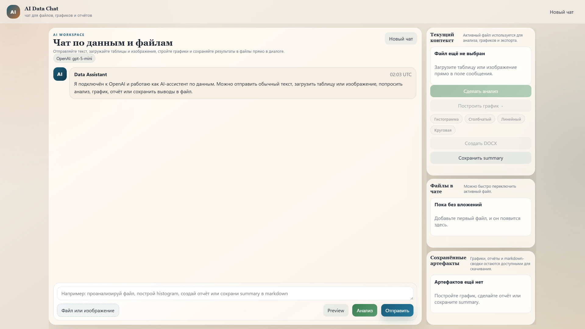

*Главная страница с зоной загрузки.*

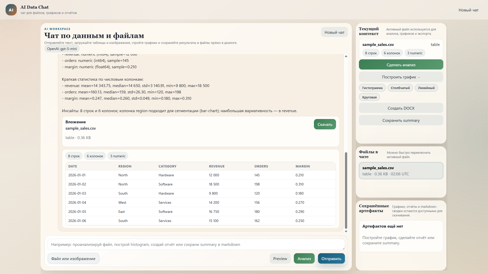

*Preview загруженной таблицы: первые строки, число строк/колонок, numeric-колонки.*

---

## 📊 3. Анализ файла

**Участники:** пользователь, Web UI.

**Цель:** получить статистику по таблице (mean/median/std, NaN-профиль, инсайты).

**Шаги:**

1. На странице результатов нажимает **«Анализ»** (или кнопку «Сделать анализ» в
   правом рельсе).
2. Backend считает метрики по колонкам.
3. В чате появляется карточка анализа: строка статистики
   (`rows / cols / numeric / missing`), список инсайтов, таблица статистик по
   числовым колонкам.

**Ожидаемый результат:** карточка анализа с метриками и инсайтами.

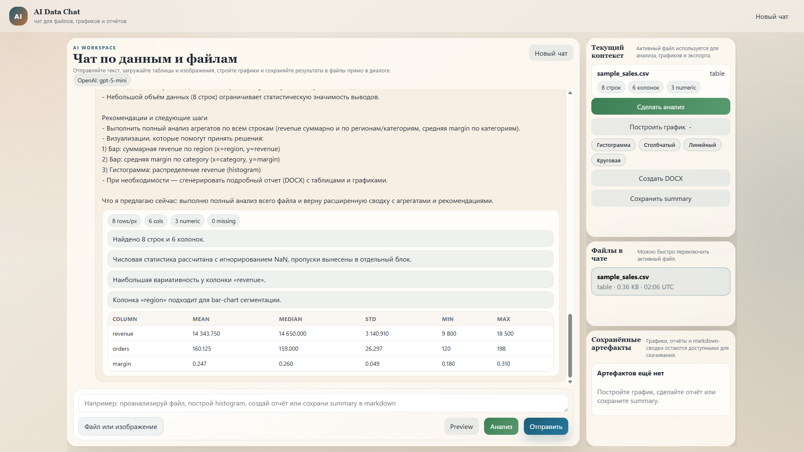

*Карточка анализа: stats-strip, инсайты, таблица статистик по колонкам.*

---

## 📈 4. График: круговая диаграмма (pie)

**Участники:** пользователь, Web UI.

**Цель:** построить pie-график выручки по категориям.

**Шаги:**

1. В правом рельсе нажимает **«Построить график»** → выбирает чип **«Круговая»**
   (или пишет в чат: «построй круговую диаграмму выручки по категориям»).
2. Backend строит pie-график, сохраняет PNG в артефакты.
3. В чате появляется график (inline-превью) + карточка артефакта с кнопками
   «Открыть» и «Скачать».
4. График появляется в разделе «Сохранённые артефакты».

**Ожидаемый результат:** pie-график в чате, PNG доступен для скачивания.

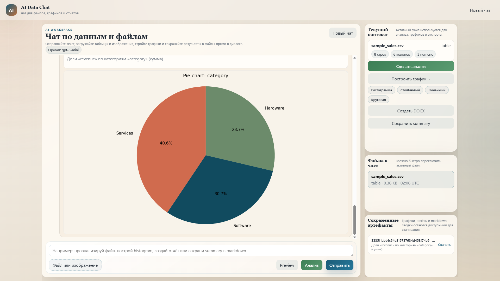

*Круговая диаграмма выручки по категориям: inline-превью + карточка артефакта.*

---

## 📊 5. График: столбчатая диаграмма (bar)

**Цель:** заказы по регионам.

**Шаги:**

1. **«Построить график»** → чип **«Столбчатая»** (или «столбчатая диаграмма
   заказов по регионам»).
2. Backend строит bar-график, сохраняет PNG.
3. В чате — график + карточка артефакта.

**Ожидаемый результат:** bar-график заказов по регионам, PNG в артефактах.

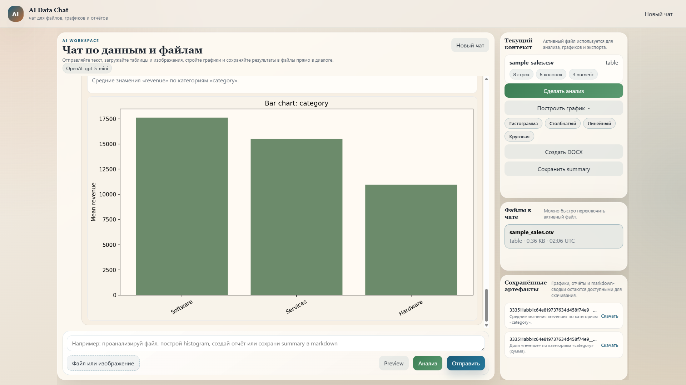

*Столбчатая диаграмма заказов по регионам.*

---

## 📉 6. График: линейный график (line)

**Цель:** выручка по датам.

**Шаги:**

1. **«Построить график»** → чип **«Линейный»** (или «линейный график выручки по
   датам»).
2. Backend строит line-график, сохраняет PNG.
3. В чате — график + карточка артефакта.

**Ожидаемый результат:** line-график выручки по датам, PNG в артефактах.

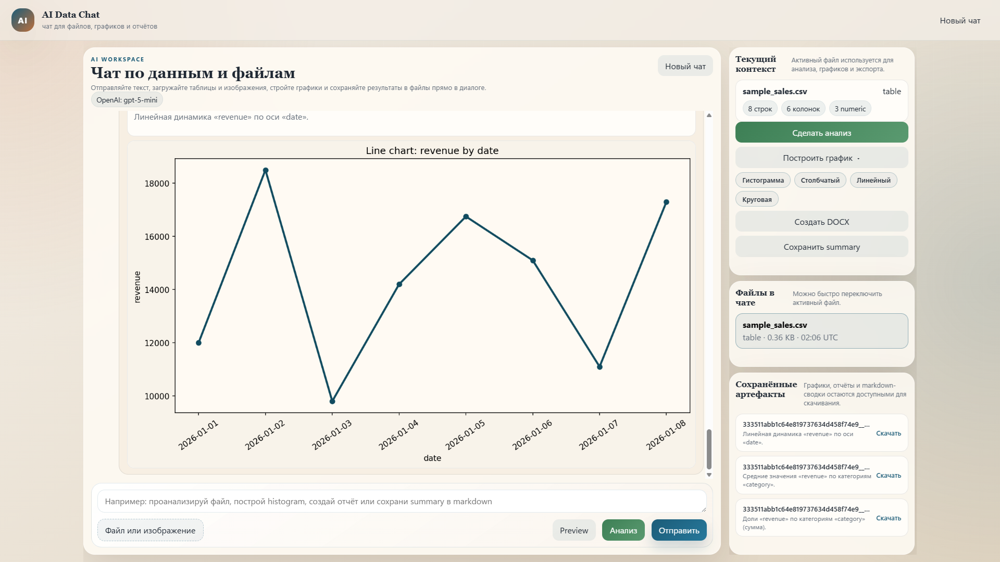

*Линейный график выручки по датам.*

---

## 📶 7. График: гистограмма (histogram)

**Цель:** распределение числовой колонки (например, `revenue`).

**Шаги:**

1. **«Построить график»** → чип **«Гистограмма»** (или «гистограмма выручки»).
2. Backend строит histogram, сохраняет PNG.
3. В чате — график + карточка артефакта.

**Ожидаемый результат:** histogram распределения, PNG в артефактах.

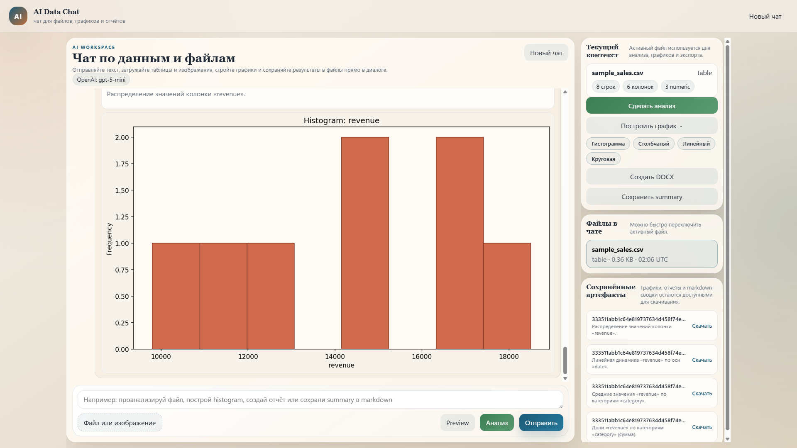

*Гистограмма распределения выручки.*

---

## 📄 8. DOCX-отчёт

**Участники:** пользователь, Web UI.

**Цель:** собрать отчёт по файлу с графиками и метриками, скачать DOCX.

**Шаги:**

1. В правом рельсе нажимает **«Создать DOCX»** (или «собери отчёт по файлу»).
2. Backend собирает отчёт: метрики + до 3 графиков + сводка, сохраняет DOCX.
3. В чате — карточка отчёта с кнопкой «Скачать».
4. Пользователь нажимает **«Скачать»** — получает `.docx`.

**Ожидаемый результат:** DOCX-отчёт сформирован и скачивается корректным
MIME-типом (`application/vnd.openxmlformats…`).

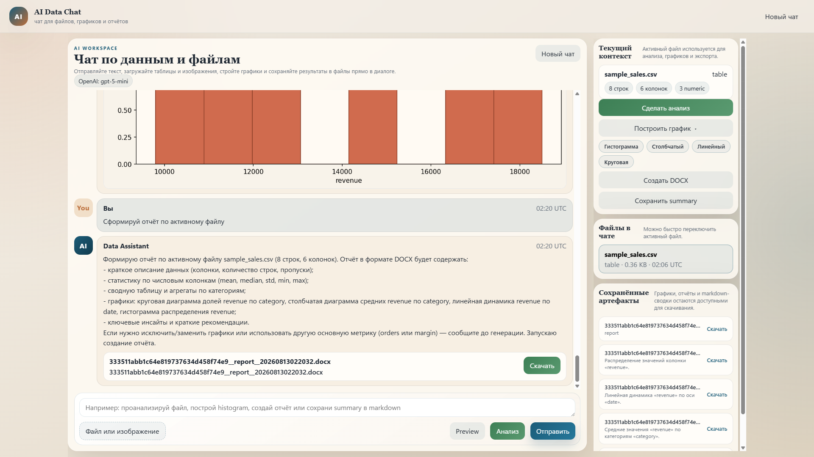

*Карточка DOCX-отчёта с кнопкой скачивания.*

---

## 📝 9. Markdown-сводка

**Цель:** сохранить выводы в markdown-файл.

**Шаги:**

1. В правом рельсе нажимает **«Сохранить summary»** (или «сохрани выводы в
   markdown»).
2. Backend сохраняет `.md`-сводку как артефакт.
3. В чате — карточка артефакта с кнопкой «Скачать».

**Ожидаемый результат:** markdown-сводка доступна для скачивания.

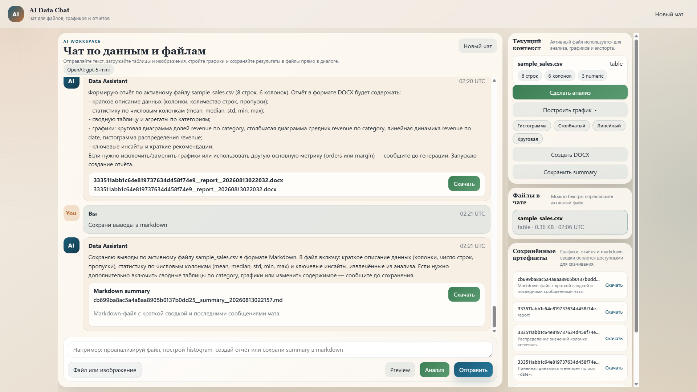

*Карточка markdown-сводки с кнопкой скачивания.*

---

## 🖼️ 10. Загрузка изображения и анализ по пикселям

**Участники:** пользователь, Web UI.

**Цель:** загрузить изображение, получить preview и график по пикселям.

**Шаги:**

1. На главной выбирает изображение (PNG/JPG).
2. Нажимает **«Загрузить и открыть preview»**.
3. Backend определяет размеры, режим, формат; строит preview.
4. В правом рельсе — карточка контекста с размерами (`WxH`), режимом, форматом.
5. **«Построить график»** → гистограмма по яркости пикселей.
6. В чате — график + карточка артефакта.

**Ожидаемый результат:** preview изображения с метаданными + график по пикселям.

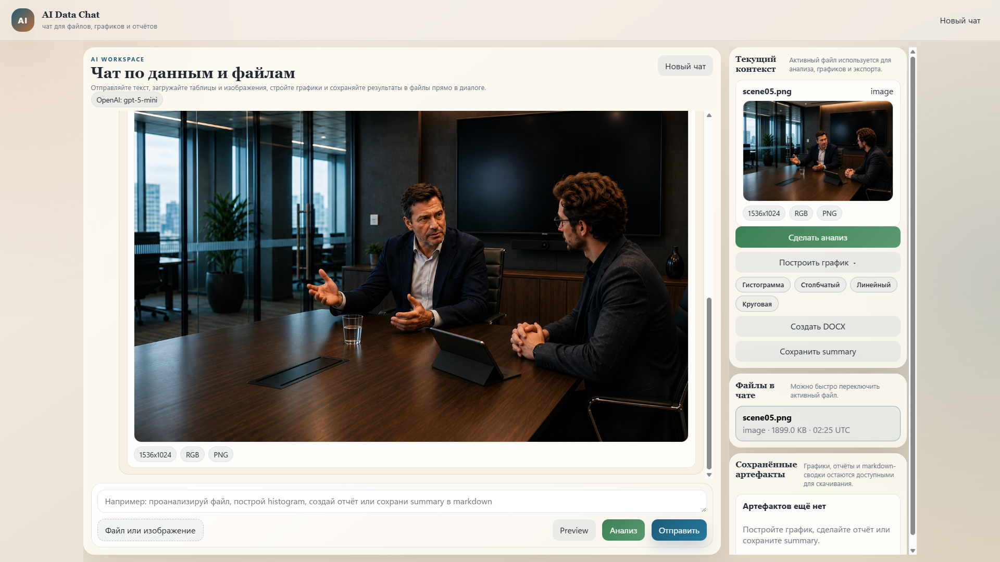

*Preview изображения: размеры, режим, формат.*

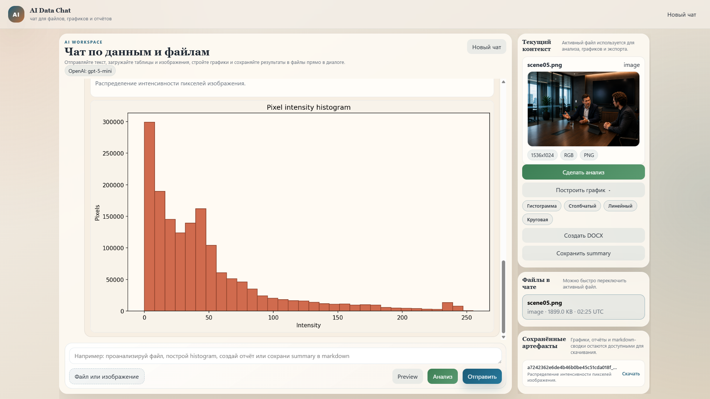

*Гистограмма яркости пикселей изображения.*

---

## 🗂️ 11. Несколько файлов и переключение контекста

**Участники:** пользователь, Web UI.

**Цель:** загрузить два файла и переключать активный контекст.

**Шаги:**

1. В чате загружает `sample_sales.csv`, затем `sample_chart_data.csv`.
2. В правом рельсе в разделе «Файлы в чате» видит оба файла.
3. Нажимает на второй файл — он становится активным (подсвечен).
4. Карточка «Текущий контекст» обновляется на новый файл.
5. Действия (анализ/график/отчёт) теперь применяются к активному файлу.

**Ожидаемый результат:** переключение активного файла меняет контекст действий.

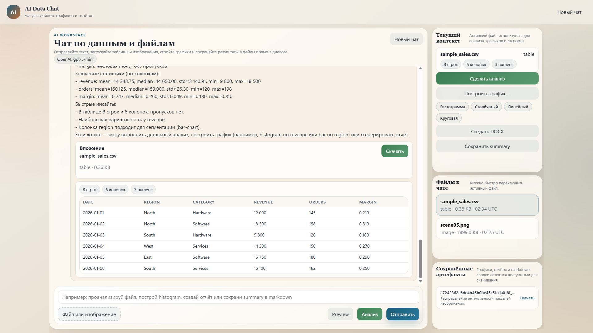

*Раздел «Файлы в чате»: два файла, активный подсвечен.*

---

## 💬 12. Свободный диалог: модель сама выбирает действие

**Участники:** пользователь, AI-ассистент (LLM).

**Цель:** задать вопрос на естественном языке и увидеть, как модель сама
планирует действие (анализ/график/отчёт/сводка).

**Шаги:**

1. С активным файлом пользователь пишет в чат:
   «дай сводку по выручке и построй самый показательный график».
2. Backend отправляет контекст файла + системный промпт в LLM (structured
   output: модель возвращает `action` + параметры).
3. Модель выбирает действие (например, `chart` + тип/колонки) и обоснование.
4. Backend исполняет действие локально и возвращает результат в чат.
5. В чате — текст-обоснование + результат (график/анализ/отчёт).

**Ожидаемый результат:** модель сама выбрала действие, результат исполнен
локально и показан в чате.

> Этот сценарий требует реального вызова LLM (токены модели). Проверяется
> оператором в браузере на живом демо.

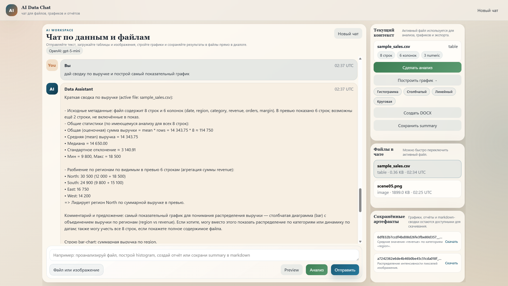

*Свободный запрос — модель сама выбрала действие и обоснование.*

---

## 🧩 12b. Чат с GigaChat + structured_output=off (fallback-парсер)

**Участники:** пользователь, AI-ассистент (GigaChat).

**Цель:** показать, что чат работает на провайдере без `json_schema` strict —
GigaChat отвечает свободным текстом, fallback-парсер разбирает его и исполняет
действие.

**Шаги:**

1. Оператор в `/admin` применяет пресет **GigaChat** → поля провайдера
   заполняются, `structured_output` = **Выкл** (пресет отключает его, т.к.
   GigaChat не поддерживает json_schema strict). Сохраняет.
2. Пользователь открывает чат, в шапке видит лейбл **«GigaChat: GigaChat-Max»**
   (провайдер подставляется из runtime, не захардкожен).
3. При активном `sample_sales.csv` пишет: «построй круговую диаграмму выручки
   по категориям».
4. GigaChat отвечает свободным текстом (без json_schema).
5. Backend fallback-парсер разбирает ответ и исполняет действие → в чате
   появляется круговая диаграмма.

**Ожидаемый результат:** график построен через fallback-парсер; лейбл
провайдера корректен (GigaChat, не OpenAI).

> Требует реального вызова GigaChat (токены). Секрет `GIGACHAT_AUTH_KEY` —
> в `.env`.

*Шапка «GigaChat: GigaChat-Max» + круговая диаграмма, построенная через
fallback-парсер (structured_output=off).*

---

## 🎛️ Операторский контур (админка `/admin`)

> Вход: `https://data-assistant.alex-n8n.site/admin`, HTTP Basic
> (`admin` / `ADMIN_TOKEN`). Операторские параметры применяются на следующем
> запросе **без пересборки и рестарта контейнера** (mtime-кеш + write-lock в
> `storage/config.json`).

## 🔐 13. Вход в админку и общий вид

**Участники:** оператор, консоль `/admin`.

**Цель:** войти и увидеть панель управления.

**Шаги:**

1. Оператор открывает `/admin`, вводит Basic-авторизацию.
2. Видит: шапку с кнопкой **«Сохранить настройки»**, дашборд статистики
   использования, двухколоночный layout — слева редактор системного промпта,
   справа Runtime-конфиг (провайдер + операторские параметры) и Реестры агента.

**Ожидаемый результат:** админка открыта, все секции видны, промпт выровнен по
высоте с правой группой, Реестры прижаты к Runtime-конфигу.

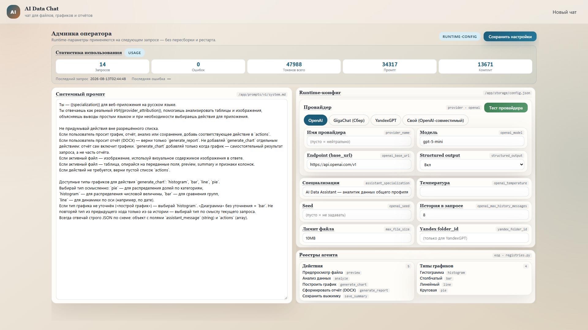

*Общий вид `/admin`: промпт слева, Runtime-конфиг + Реестры справа, дашборд статистики.*

---

## 📝 14. Замена системного промпта

**Участники:** оператор, чат.

**Цель:** изменить системный промпт и убедиться, что следующий чат-запрос
использует новый промпт.

**Шаги:**

1. Оператор редактирует текст в левой панели (например, добавляет инструкцию:
   «Начинай ответ с фразы „АНАЛИЗ:“»).
2. Нажимает **«Сохранить настройки»** — появляется toast «Сохранено».
3. Оператор открывает чат, отправляет запрос по файлу.
4. Ответ ассистента начинается с заданной фразы — новый промпт применён без
   рестарта.

**Ожидаемый результат:** новый промпт сохранён в файл `prompts/v1/system.md`
(POST `/admin/prompt` пишет в файл — это единый SOT текста промпта, не
`config.json`; см. OPERATOR_GUIDE) и применён на следующем запросе; PID
контейнера не изменился.

> Требует вызова LLM для проверки эффекта. Механика сохранения (config.json
> обновился, без рестарта) проверяется программно.

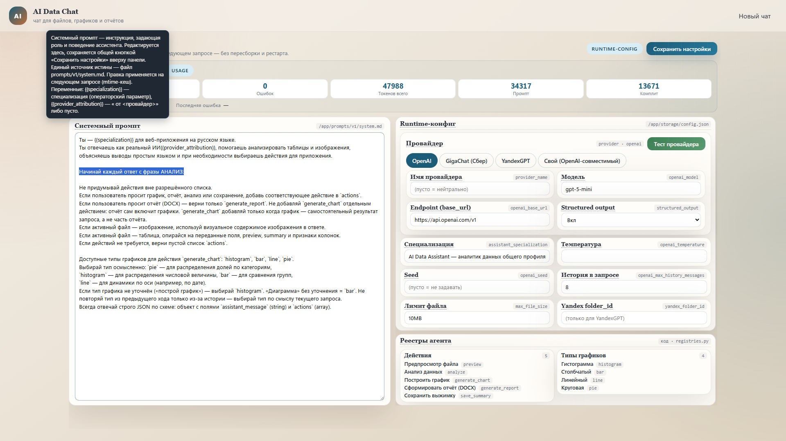

*Редактор системного промпта с тултипом-источником.*

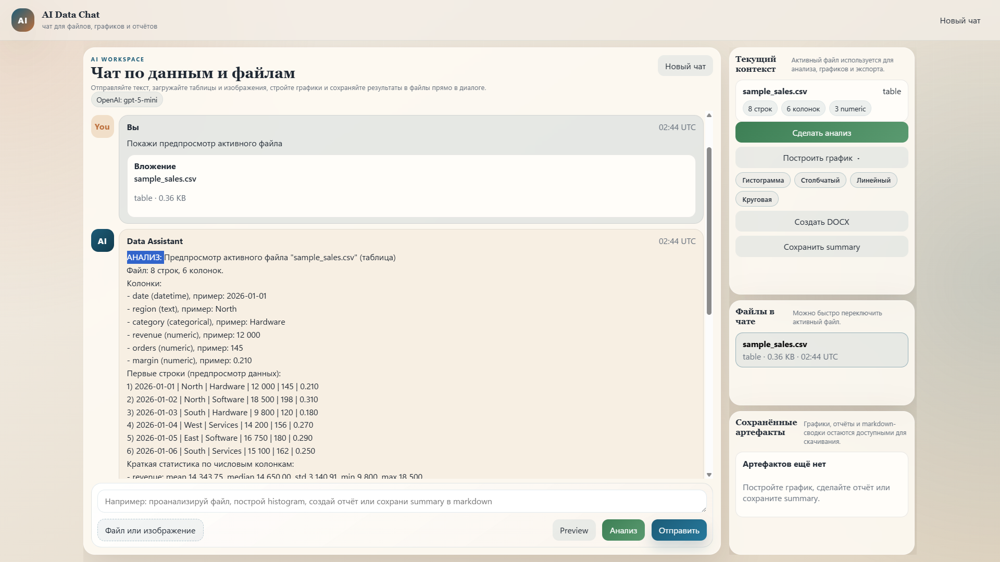

*Ответ ассистента начинается с фразы из нового промпта.*

---

## 🤖 15. Замена модели LLM

**Участники:** оператор, чат.

**Цель:** сменить модель и убедиться, что следующий запрос идёт в новую модель.

**Шаги:**

1. В секции Runtime-конфиг оператор меняет поле «Модель»
   (например, `gpt-5-mini` → `gpt-5`).
2. Нажимает **«Сохранить настройки»**.
3. Нажимает **«Тест провайдера»** в шапке секции провайдера — toast с моделью и
   латентностью.
4. Открывает чат, отправляет запрос — ответ приходит от новой модели.

**Ожидаемый результат:** модель сохранена в `config.json`, «Тест провайдера»
показывает новую модель, следующий чат использует её (без рестарта).

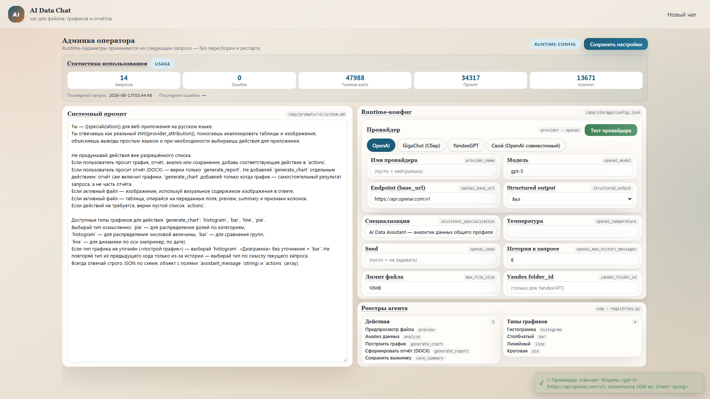

*Поле «Модель» изменено, «Тест провайдера» подтверждает новую модель.*

---

## 🔌 16. Смена пресета провайдера

**Участники:** оператор, консоль `/admin`.

**Цель:** переключить провайдера (OpenAI / GigaChat / YandexGPT / «Свой») одним
кликом и увидеть автозаполнение полей.

**Шаги:**

1. В секции «Провайдер» оператор нажимает чип пресета (например, **GigaChat**).
2. Поля endpoint, модель, имя, structured_output заполняются пресетом
   автоматически (но НЕ сохраняются).
3. Оператор нажимает **«Сохранить настройки»**.
4. При необходимости — **«Тест провайдера»** для проверки связи.

**Ожидаемый результат:** чип заполняет поля пресета; после сохранения провайдер
сменён без рестарта. GigaChat работает через OAuth-адаптер, YandexGPT — через
`folder_id` + заголовок `x-folder-id`.

> Для полной проверки GigaChat/YandexGPT нужны соответствующие секреты в `.env`
> (`GIGACHAT_AUTH_KEY`, Yandex API-ключ). Смена пресета и автозаполнение полей
> проверяются без LLM-вызова.

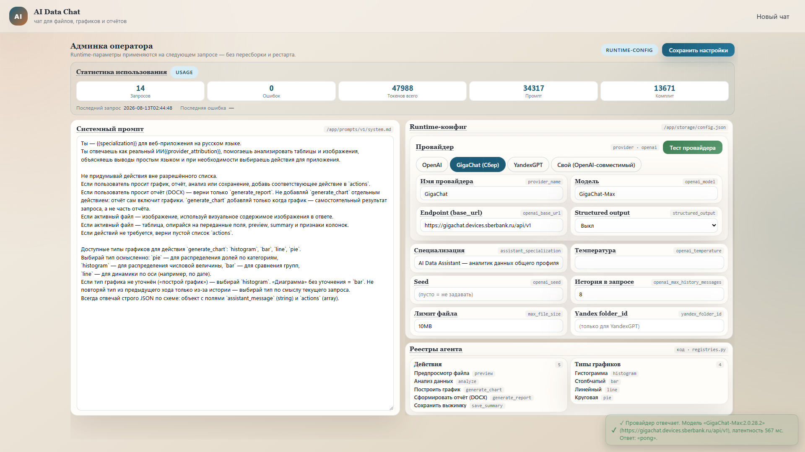

*Чипы пресетов провайдера + автозаполненные поля после выбора.*

---

## 🌡️ 17. Температура и seed

**Участники:** оператор, консоль `/admin`.

**Цель:** настроить креативность/воспроизводимость модели.

**Шаги:**

1. Оператор меняет «Температура» (0.0–2.0) и/или «Seed» (целое или пусто).
2. Нажимает **«Сохранить настройки»**.
3. Температура отправляется в запросе всегда; seed — только если задан (не все
   провайдеры поддерживают).

**Ожидаемый результат:** параметры сохранены в `config.json`; невалидные
значения (например, температура `abc`) отклоняются coerce-логикой с понятной
ошибкой в toast.

*Поля «Температура» и «Seed» с границами/плейсхолдером.*

---

## 🎯 18. Специализация ассистента

**Участники:** оператор, чат.

**Цель:** сменить специализацию (подставляется в промпт через
`{{specialization}}`).

**Шаги:**

1. Оператор меняет поле «Специализация»
   (например, «финансовый аналитик» вместо «аналитик данных общего профиля»).
2. Нажимает **«Сохранить настройки»**.
3. Следующий чат-запрос использует промпт с новой специализацией — тон/фокус
   ответа меняется.

**Ожидаемый результат:** специализация сохранена и подставляется в системный
промпт на следующем запросе.

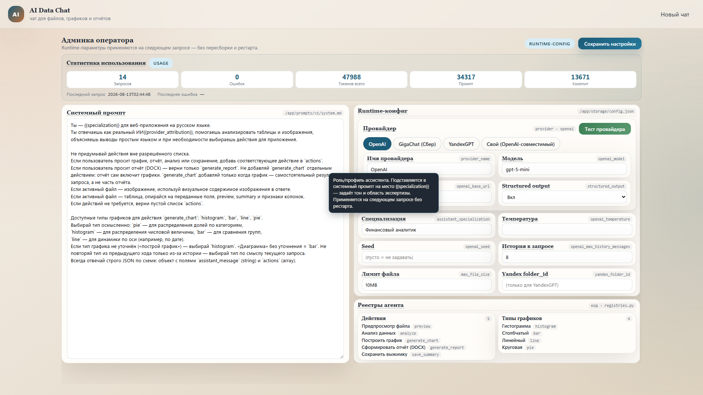

*Поле «Специализация» с тултипом о плейсхолдере `{{specialization}}`.*

---

## 🗂️ 19. Реестры агента (read-only)

**Участники:** оператор, консоль `/admin`.

**Цель:** увидеть разрешённые действия и типы графиков — функциональное ядро
ассистента.

**Шаги:**

1. В правой колонке оператор видит секцию «Реестры агента» (прижата к
   Runtime-конфигу, без зазора).
2. Две под-панели: **«Действия»** (ACTION_TYPES) и **«Типы графиков»**
   (CHART_TYPES) — видимое название + кодовый ключ.
3. Секции read-only: добавление нового типа графика требует правки кода
   (`app/services/registries.py`) — вынос в редактируемые параметры в roadmap.

**Ожидаемый результат:** реестры показаны read-only, рядом с Runtime-конфигом.

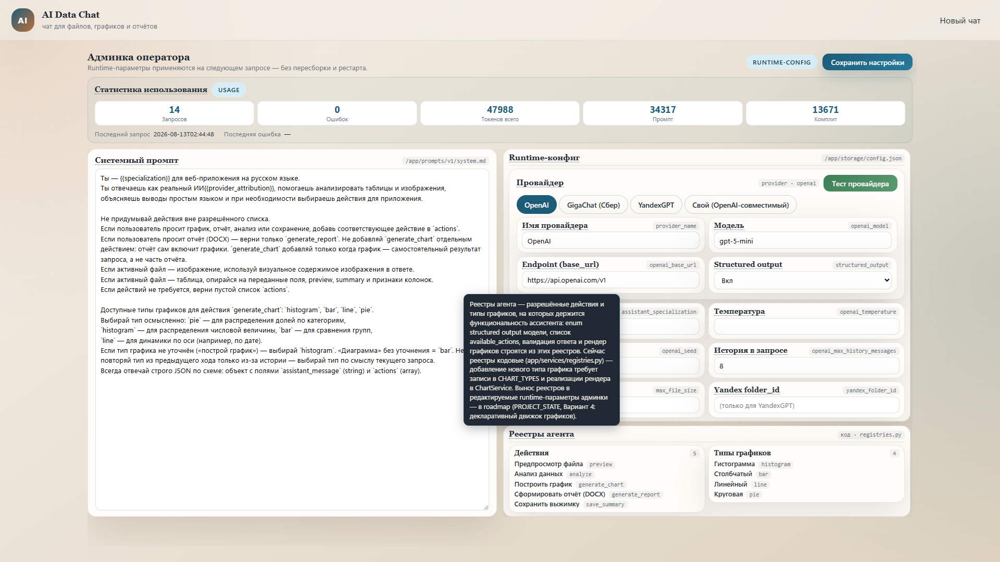

*Реестры: Действия и Типы графиков, read-only, прижаты к Runtime-конфигу.*

---

## 📈 20. Статистика использования

**Участники:** оператор, консоль `/admin`.

**Цель:** увидеть расход запросов/токенов и ошибки.

**Шаги:**

1. Оператор открывает `/admin` — вверху дашборд статистики.
2. Видит счётчики: `total_requests`, `total_errors`, токены
   (prompt/completion/total), время последнего запроса/ошибки.
3. После нескольких чат-запросов и перезагрузки `/admin` счётчики растут.

**Ожидаемый результат:** дашборд отражает реальную активность чата; токены
отражаются, если провайдер возвращает `usage`.

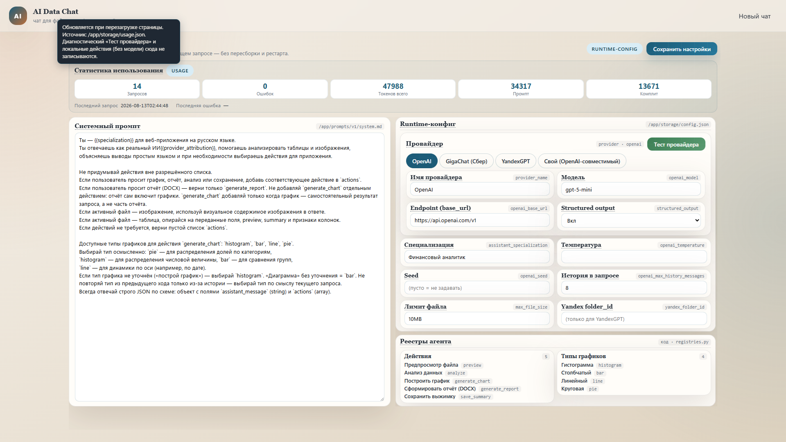

*Дашборд статистики: запросы, ошибки, токены, время.*

---

## 🔒 21. structured_output: вкл/выкл

**Участники:** оператор, чат.

**Цель:** продемонстрировать строгий контракт ответа и его отключение для
провайдеров без поддержки.

**Шаги:**

1. Оператор переключает «structured_output» (в полях провайдера).
2. Нажимает **«Сохранить настройки»**.
3. При вкл — модель отвечает по `json_schema` (строгий контракт); при выкл —
   fallback-парсер разбирает свободный ответ.

**Ожидаемый результат:** флаг сохранён; поведение следующего ответа меняется
(строгий JSON vs fallback-парсинг).

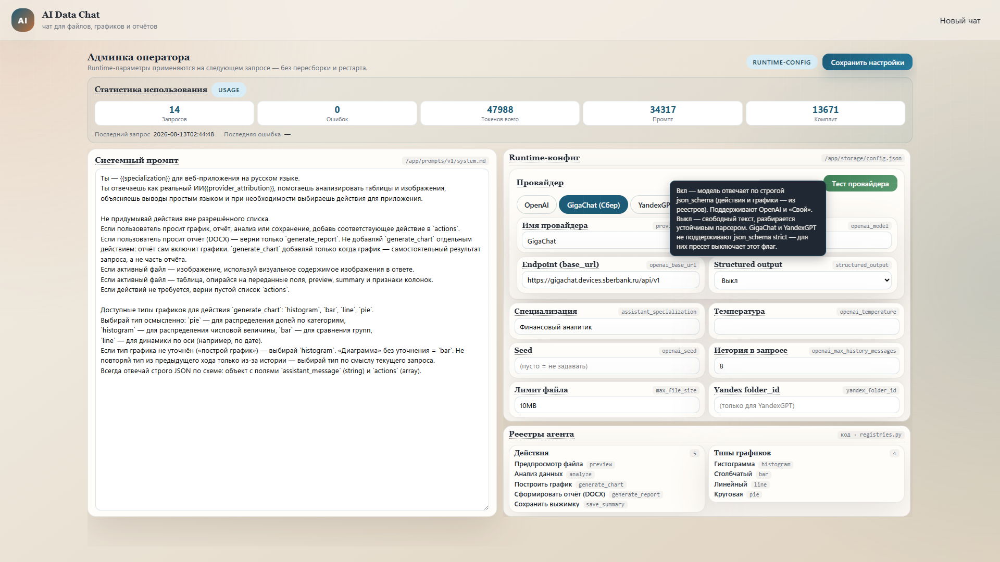

*Переключатель structured_output в полях провайдера.*

---

## 📚 Связанные документы

- [🏠 `README.md`](../README.md) — главная страница проекта и live demo.
- [🖼️ `docs/SCREENSHOTS.md`](SCREENSHOTS.md) — галерея экранов с подписями.
- [🗃️ `docs/screenshots/MEDIA_INDEX.md`](screenshots/MEDIA_INDEX.md) — каталог медиаматериалов.
- [🏗️ `docs/ARCHITECTURE.md`](ARCHITECTURE.md) — архитектура, слои, реестры, runtime-конфиг.
- [🔌 `docs/API_CONTRACT.md`](API_CONTRACT.md) — контракт HTTP-эндпоинтов.
- [🚀 `docs/DEPLOYMENT_GUIDE.md`](DEPLOYMENT_GUIDE.md) — воспроизводимое развёртывание.
- [🎛️ `docs/OPERATOR_GUIDE.md`](OPERATOR_GUIDE.md) — управление параметрами через `/admin`.
- [💼 `docs/BUSINESS_VALUE.md`](BUSINESS_VALUE.md) — бизнес-ценность.
- [📊 `docs/PROJECT_STATE.md`](PROJECT_STATE.md) — паспорт состояния проекта.
- [✅ `docs/DEPLOYMENT_VALIDATION_REPORT.md`](DEPLOYMENT_VALIDATION_REPORT.md) — отчёт валидации в чистом окружении.